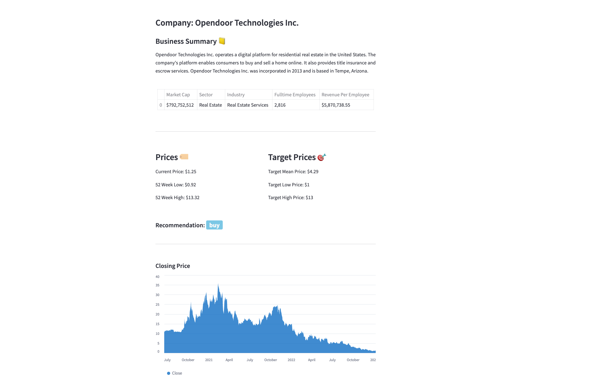
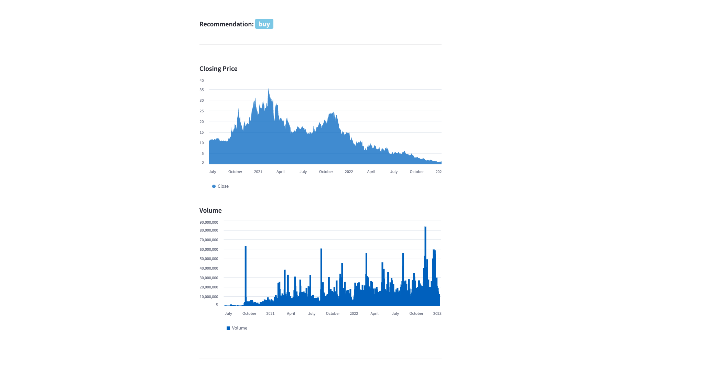
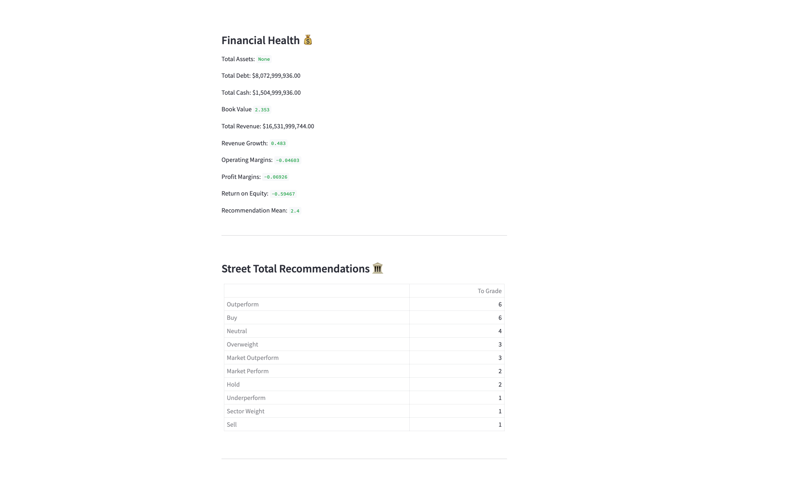
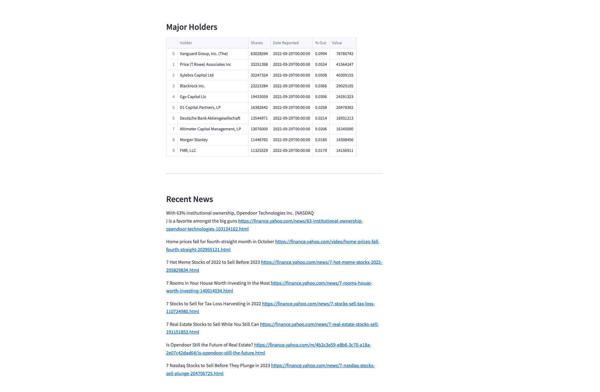

# Mini Bloomberg Terminal   🚀


<br>

Run app locally
-----------------

```python
pip3 install -r requirements.txt

streamlit run app.py
```

<br>

Features
-----------------
1. Enter stock ticker
2. A report is automatically generated 


<br>

Use Case
--------------
Researching stock should be simplified. Aggregating, cleaning, and compling information can be a time <br>
consuming task. This application aims to simplify this process, which allows the analyst to focus on what's critical, <br>
before investing resources on a much comprehensive report. <br>


<br>

Upcoming Features
--------------------
1. Allow app to compare target stock with peers in respective sectors
2. Add more styling, theming 🎨
3. Generate a stock recommendation score for user
4. Industry ranking


<br>

Common Issues
----------------------
Application will break, if user enters an invalid ticker symbol. <br>


<br>


<br>

<br><i>Stock General Info</i>



<br>

<br><i>Stock price and volume charts</i>



<br>

<br>

<br><i></i>



<br>

<br>

<br><i>Figure D</i>



<br>

<br>


VISIT 👉 <a href="https://tinyurl.com/2qc838ch" target="_blank">Demo Site</a>

<br>


